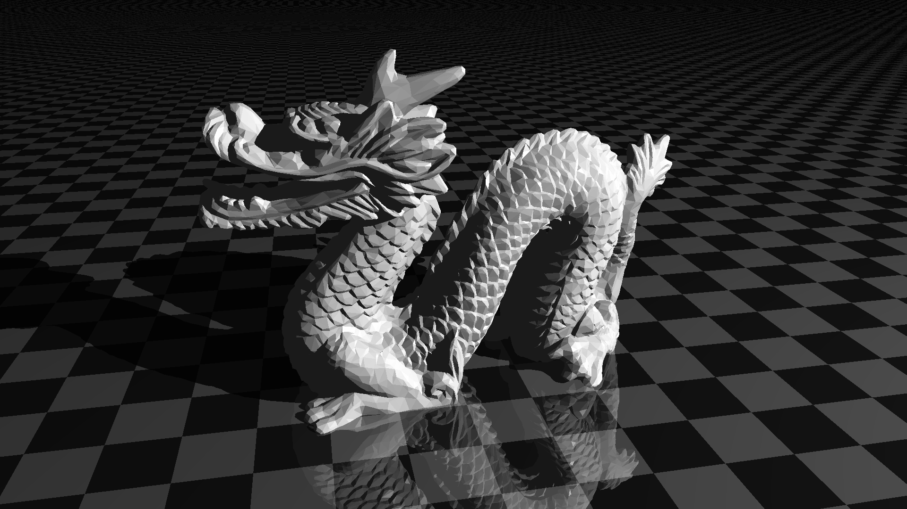
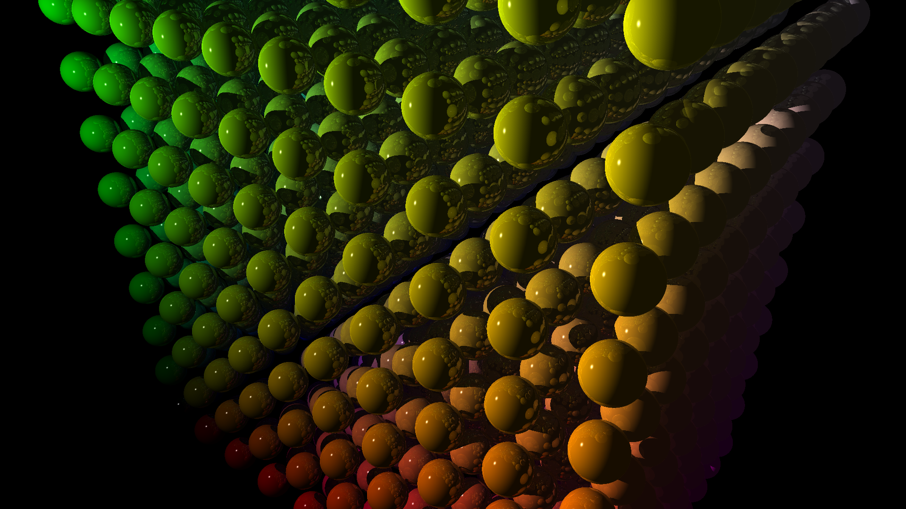
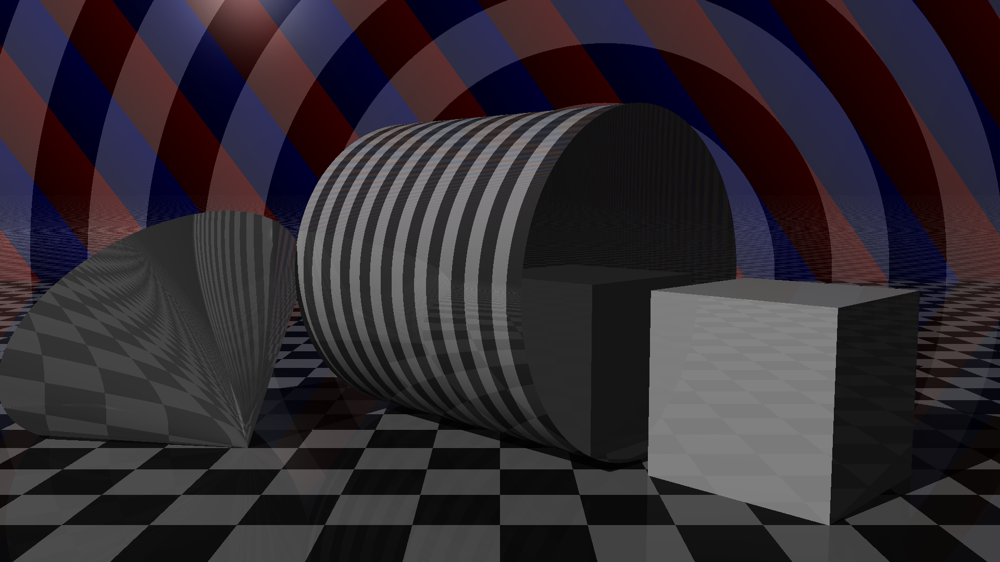

# The RayTracer Challenge
This code was created while reading the book **[The Ray Tracer Challenge](https://pragprog.com/book/jbtracer/the-ray-tracer-challenge)** by **Jamis Buck**. 

Some pictures that were produced by this program:

The following basic primitives are supported:
* Spheres
* Planes
* Cubes
* Cylinders
* Cones
* Triangles
These can also be combined into more complex shapes through constructive solid geometry (CSG).

Other features:
* Patterns (colored stripes, rings, ...) can be applied to every shape
* Phong reflection model for light sources
* Reflection and refraction
* Loading triangles / polygons from .obj files (including normal interpolation)
* Images are exported to .ppm files
* Shapes can be grouped together and partitioned into axis aligned bounding boxes (AABBs) in order to optimize large scenes
* Support for one or more point light source(s)

Possible extensions / improvements
* Loading scenes from files
* Mutlithreaded rendering
* Realtime rendereing with small resolution (Live preview)
* Textures (See [bonus chapter](http://www.raytracerchallenge.com/bonus/texture-mapping.html))
* Applying perlin noise to patterns
* Allow shapes to cast no shadows
* Export to more file formats
* Optimize cube intersection algorithm
* Procedural patterns / scenes
* Skybox
* Optimize shape transformations (Skip matrix multiplication if no transform was set)
* Bilinear interpolation
* .mtl format for textured shapes (complements the .obj format)
* Area lights
* Soft shadows
* Spotlights
* Focal blur
* Motion blur
* Anti aliasing
* Normal pertubation
* Torus primitive

